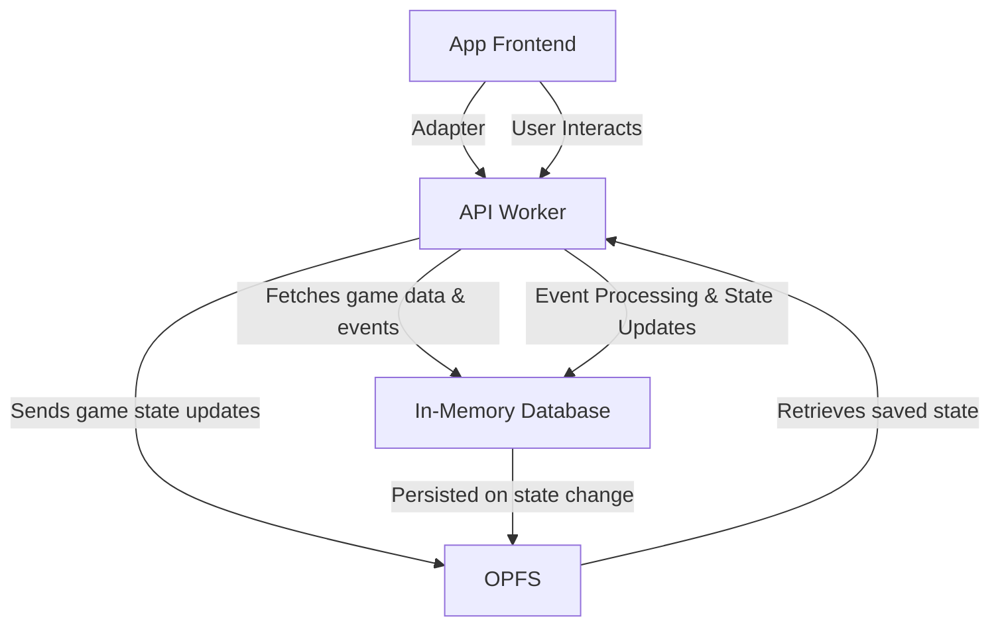

# Architecture Documentation for `Pillage First, Ask Questions Later`

## 1. Introduction

This document provides an overview of the architecture, structure, and key technologies used in the development of the **Pillage First, Ask
Questions Later** game. It covers some implementation details, notes important files and describes application lifecycle.

---

## 2. Technology Stack

- **Frontend:** [React](https://react.dev) + [TypeScript](https://www.typescriptlang.org/)
- **State Management:** [React Query](https://tanstack.com/query/latest)
- **UI Framework:** [Tailwind CSS](https://tailwindcss.com)
- **Routing:** [React Router v7 - framework mode](https://reactrouter.com)
- **Build System:** [Vite](https://vitejs.dev)
- **Format and lint:** [Biome.js](https://biomejs.dev)
- **Localization:
  ** [i18next](https://www.i18next.com) + [react-i18next](https://react.i18next.com) + [i18next-parser](https://github.com/i18next/i18next-parser)
- **Unit testing:** [Vitest](https://vitest.dev)
- **Deployment:** Netlify ([Master Deploy](https://pillagefirst.netlify.app) | [Dev Deploy](https://develop--pillagefirst.netlify.app))
- **Version Control:** GitHub ([Repository](https://github.com/jurerotar/Pillage-First-Ask-Questions-Later))

---

## 3. Project Structure and important files

The project follows a **colocation** principle, meaning files related to a feature (components, tests, hooks,... and utilities) are kept
close to each other within the same directory. This approach improves maintainability and makes it easier to find and modify related code.

**Keep related files together** – A component's styles, tests, and utilities should be in the same directory.

**Encapsulate logic per feature** – Features should have their own directory inside the app/ folder, containing its related components,
hooks, providers,... and tests.

```
├── .github                 # GitHub-specific configurations and workflows
├── .husky                  # Pre-commit hooks for enforcing code quality
├── app                     # Main application source code
│   ├── (design-system)     # Temporary route group allowing you to see a list of icons app uses (/design-system/icons)
│   ├── (game)              # Game-specific routes and assets
│   │   ├── (xxx)           # Game routes (/resources, /map,...)
│   │   ├── providers       # Game engine, game-state,... providers
│   │   ├── api             # local-api
│   │   ├── assets          # Buildings, units, items... data
│   │   ├── layout.ts       # Game-only layout
│   │   ├── ...
│   ├── (public)            # Public pages (/, /create-new-server)
│   │   ├── workers         # Server creation workers
│   │   ├── layout.ts       # Public-pages only layout
│   │   ├── ...
│   ├── interfaces          # TypeScript interfaces and types
│   ├── localization        # Localization files
│   ├── tests               # Unit test environments and mocks
│   ├── root.tsx            # Root entry point for the application
│   ├── routes.ts           # Application route definitions
│   ├── ...
├── docs                    # Project documentation
├── public                  # Static files served by the app (e.g., index.html)
├── scripts                 # Custom scripts for development and build automation
```

---

## 4. Game lifecycle

The app consists of 3 separate logic layers:

- Frontend
- API worker
- In-memory database

### Frontend

Frontend is built with React and TypeScript. Components are built with ShadCN.

### API worker

When a user navigates to a game URL (`/game/s-{server-slug}`), the app initializes an `api-worker`. The purpose of this
worker is to act as an RESTful API. It provides a basic router, exposes endpoints, accesses the database, posts responses through message ports,
acts as a WebSocket server,.... It essentially provides a service you'd typically expect from a normal RESTful API. The goal of this is to
minimize the differences between offline and online app architectures.

Frontend is connected to this worker through an `adapter`. This `adapter` exposes a `fetcher` function, which the frontend uses to connect
to the worker.

This design may seem a bit of an overkill for an offline application, but there are reasons for it. This type of design allows for minimal
differences between offline and online behavior. By simply changing the `adapter`, you are able to connect the frontend to a different data
source (e.g. actual backend for an online app), without having to touch rest of the frontend.
This makes the frontend completely reusable for both offline & online versions of the game.

### Database

Game state is kept in `@tanstack/react-query`'s `QueryClient` object. On any change to the object, data is persisted to browser's OPFS
storage.
While `react-query` may seem as an odd choice for a database (and it certainly is!), it was chosen as such for historical and DX reasons.
Before the migration to this new architecture, `react-query` was used a state management solution on frontend. Not wanting to migrate all
the logic to an actual database implementation, I have decided to keep (ab)using it as a database. If there's performance issues with its
usage in the future, it can be partially/fully swapped with an actual database (ex. SQLite).

### Architecture graph



### Important files

- [`api-worker.ts`](/app/(game)/api/workers/api-worker.ts)
- [`api-routes.ts`](/app/(game)/api/api-routes.ts)
- [`api-provider.tsx`](/app/(game)/providers/api-provider.tsx)

### How would a multiplayer integration look like?

Frontend expects a REST API and a WebSocket server. The list of expected routes is found in `api-routes.ts`. Request shapes and responses
are found in `app/(game)/api` folder. To integrate your own backend, you need to implement the API routes (e.g., fetching game state,
interacting with events) and WebSocket support. Once these routes are live, provide a `fetcher` function in the `api-provider.tsx`. This
function is typically a `fetch` function that connects the frontend to the backend. After this, the app will be fully connected to the
backend
for multiplayer functionality.

Optionally, you can remove the `app/(game)/api` folder from your fork, as it will no longer be needed when connecting to a real backend.

---

## 5. Deployment & CI/CD

- The project is hosted on **Netlify**, with separate environments for master and develop branches as well as separate builds per branch and
  PRs.
- **GitHub Actions** are set up for automated testing, type-checking, lint & format validation.
