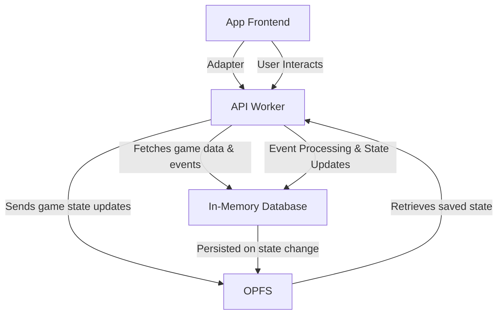

# Architecture Documentation for `Pillage First, Ask Questions Later`

## 1. Introduction

This document provides an overview of the architecture used in **Pillage First, Ask Questions Later** game. It covers some implementation details, notes important files and caveats.
Please refer to [contribution guide](../CONTRIBUTING.md) for the list of technologies and project structure used.

## 2. App architecture

The app consists of 3 separate logic layers:

- Frontend
- API worker
- In-memory database

### Frontend

Frontend is built with React and TypeScript. Components are built with ShadCN. State management and data fetching is handled with `tanstack/query`. It's built with async in mind.
It's completely headless and requires a RESTful-like API to work.

### API worker

API worker is a worker that implements a RESTful-like API. Its purpose is to act as a typical RESTful API; receiving requests and sending responses.
It only exists in the offline version of the application, and it's meant to bridge the architecture gap between an offline-first and online app.
Api worker defines a set of "endpoints", which look like this:

```ts
const serverRoutes = [
  {
    method: 'GET',
    path: '/server',
    handler: getServer,
  },
];
```

These endpoints mimic traditional RESTful API endpoints. We then implement a custom fetcher function.
This fetcher function follows the specification of the native `fetch` function (and just is the native `fetch` function in an online version of the app).
Thus, by changing the fetcher, we're able to connect to different data providers (api-worker in offline version and an actual backend in online version).

Example of the fetcher function used by the offline app:

```ts
export type Fetcher = ReturnType<typeof createWorkerFetcher>;

export const createWorkerFetcher = (worker: Worker) => {
  return async <TData, TBody = unknown>(
    url: string,
    args?: ApiWorkerMessage<TBody>,
  ): Promise<{ data: TData }> => {
    const { port1, port2 } = new MessageChannel();

    return new Promise((resolve) => {
      port1.addEventListener('message', ({ data }) => {
        port1.close();
        resolve(data);
      });
      port1.start();

      const message: PostMessage = {
        url,
        method: args?.method ?? 'GET',
        body: args?.body ?? null,
        params: args?.params ?? null,
      };

      worker.postMessage(message, [port2]);
    });
  };
};
```

In an online version of the app, this would be the native `fetch` function.

**Relevant files**:
- https://github.com/jurerotar/Pillage-First-Ask-Questions-Later/blob/master/app/(game)/providers/api-provider.tsx
- https://github.com/jurerotar/Pillage-First-Ask-Questions-Later/blob/master/app/(game)/utils/worker-fetch.ts

#### How it all works together

In the offline version of the app, there is no server. Everything happens exclusively on your device.
But, to allow the same codebase to work with an online version with minimal required changes, we can't just simply manipulate data on the frontend.
For this reason, we implemented the API worker.

When a user opens a game world, the app spawns a new worker and runs the API worker script on it. The purpose of this
worker is to act as an RESTful API. It exposes required REST API endpoints, queries and writes to the database, posts responses through
message
ports, acts as a WebSocket server,.... It essentially provides a service you'd typically expect from a fully-fledged backend. This allows
the frontend to be truly headless, making it integratable by both offline and online versions of the app. Frontend manipulates data only through this worker and no other data is persisted otherwise.

This design does complicate the codebase for the offline-version of the application, but it's the only way to allow the headless nature of
the frontend. By simply changing the fetcher function, you are able to connect the frontend to a different data
source (e.g. actual backend for an online app), without having to touch rest of the frontend.

### Database

Offline version of the application does not use a traditional database.
Instead, game state is kept in `@tanstack/react-query`'s `QueryClient` object. There's a couple of reason for it, most important one being that initially, `react-query` with a persister plugin was the state-management and persistence solution used.
This means that all the state was already in this single object. When we began considering a rewrite of the application to allow for a future online version, a large part of the app state already existed in `QueryClient` and it would have been too cumbersome to rewrite all the state as well.
For this reason, as well as ease of use reasons, `react-query` was kept as a state management solution on both the frontend and the API worker.

We have tried a `SQLite` implementation was tried as a proof-of-concept and while it does work, it also requires a massive rewrite of the app.

While `react-query` may seem as an odd choice for a database (and it certainly is!), I argue it's good enough for now. It's widely used in
frontend development as such, it allows new
developers to pick it up quickly. If there's performance issues with its usage in the future, it can be partially/fully swapped with an
actual database (ex. SQLite).

### Architecture graph



### Important files

- [`api-worker.ts`](/app/(game)/api/api-worker.ts)
- [`api-routes.ts`](/app/(game)/api/api-routes.ts)
- [`api-provider.tsx`](/app/(game)/providers/api-provider.tsx)

### How would a multiplayer integration look like?

Frontend expects a REST API and a WebSocket server. The list of expected routes is found in `api-routes.ts`. Request parameters and responses
are found in `app/(game)/api` folder. To integrate your own backend, you need to implement the API routes (e.g., fetching game state,
interacting with events) and WebSocket support. Once these routes are live, provide a `fetcher` function in the `api-provider.tsx`. This
function is typically a `fetch` function that connects the frontend to the backend. After this, the app will be fully connected to the
backend
for multiplayer functionality.

Optionally, you can remove the `app/(game)/api` folder from your fork, as it will no longer be needed when connecting to a real backend.
