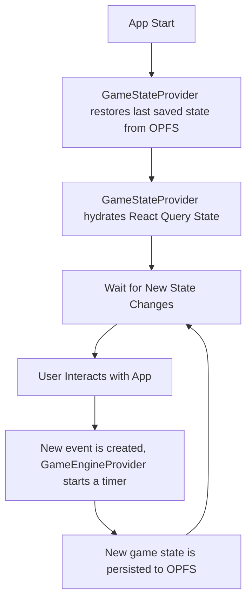

# Architecture Documentation for Pillage First, Ask Questions Later

## 1. Introduction

This document provides an overview of the architecture, structure, and key technologies used in the development of the **Pillage First, Ask
Questions Later** game. It covers some implementation details, notes important files and describes application lifecycle.

---

## 2. Technology Stack

- **Frontend:** [React](https://react.dev) + [TypeScript](https://www.typescriptlang.org/)
- **State Management:** [React Query](https://tanstack.com/query/latest)
- **UI Framework:** [Tailwind CSS](https://tailwindcss.com)
- **Routing:** [React Router](https://reactrouter.com)
- **Build System:** [Vite](https://vitejs.dev)
- **Format and lint:** [Biome.js](https://biomejs.dev)
- **Localization:** [i18next](https://www.i18next.com) + [react-i18next](https://react.i18next.com)
- **Unit testing:** [Vitest](https://vitest.dev)
- **Deployment:** Netlify ([Master Deploy](https://pillagefirst.netlify.app) | [Dev Deploy](https://develop--pillagefirst.netlify.app))
- **Version Control:** GitHub ([Repository](https://github.com/jurerotar/Pillage-First-Ask-Questions-Later))

---

## 3. Project Structure and important files

The project follows a **colocation** principle, meaning files related to a feature (components, tests, hooks,... and utilities) are kept
close to each other within the same directory. This approach improves maintainability and makes it easier to find and modify related code.

**Keep related files together** – A component's styles, tests, and utilities should be in the same directory.

**Encapsulate logic per feature** – Features should have their own directory inside the app/ folder, containing its related components,
hooks, providers,... and tests.

```
├── .github                 # GitHub-specific configurations and workflows
├── .husky                  # Pre-commit hooks for enforcing code quality
├── app                     # Main application source code
│   ├── (design-system)     # Temporary route group allowing you to see a list of icons app uses (/design-system/icons)
│   ├── (game)              # Game-specific routes and assets
│   │   ├── (xxx)           # Game routes (/resources, /map,...)
│   │   ├── providers       # Game engine, game-state,... providers
│   │   ├── assets          # Buildings, units, items... data
│   │   ├── layout.ts       # Game-only layout
│   ├── (public)            # Public pages (/, /create-new-server)
│   │   ├── workers         # Server creation workers
│   │   ├── layout.ts       # Public-pages only layout
│   ├── interfaces          # TypeScript interfaces and types
│   ├── tests               # Unit test environments and mocks
│   ├── root.tsx            # Root entry point for the application
│   ├── routes.ts           # Application route definitions
├── docs                    # Project documentation
├── locales                 # Localization files
├── public                  # Static files served by the app (e.g., index.html)
├── scripts                 # Custom scripts for development and build automation
```

---

## 4. Game lifecycle

On opening a game url (`/game/s-{server-slug}/v-{village-slug}`), a `GameStateProvider` provider gets mounted. This provider is responsible
for providing game state (map, hero data, units,...) to consumers as well as handle saving said state through
`@tanstack/react-query-persist-client` module.
Data is being persisted to browser's origin private file system and never leaves user's machine. Data is persisted on every state change
through `sync-worker.ts`.

Next, `GameEngineProvider` is mounted. This provider has a singular task of executing events at specific times. Whenever a user executes an
action,
an `event` object is created. This `event` object contains action details, along with `startsAt` and `duration` properties.
`GameEngineProvider`'s
responsibility is to maintain a sorted list of these events, keep a running timer for the earliest event and run a custom `resolver`
function when event
is expected to resolve. Each `resolver` function is tied to specific event type. Resolvers have access to game state and thus may trigger
new events or
delete existing ones.

To maintain an illusion of app running even while user is not using it actively, `GameEngineProvider` executes all expired events on
application start.
Example of this: user starts a building process that takes an hour. User closes the app and comes back after 2 hours. On app load,
`GameEngineProvider` will loop through
the list of events and sequentially execute each one that should have already been resolved. Since 2 hours have passed, building will get
upgraded.



---

## 5. Deployment & CI/CD

- The project is hosted on **Netlify**, with separate environments for master and develop branches as well as separate builds per branch and
  PRs.
- **GitHub Actions** are set up for automated testing, type-checking, lint & format validation.
